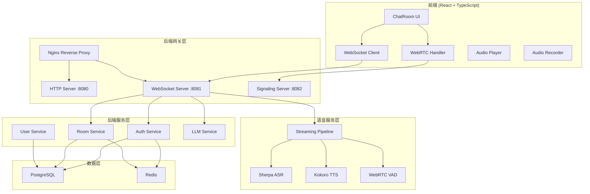
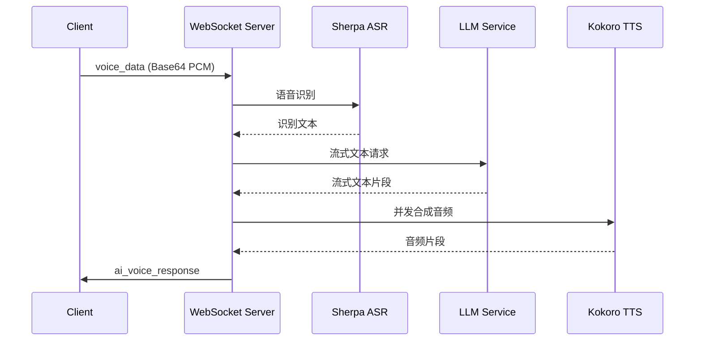
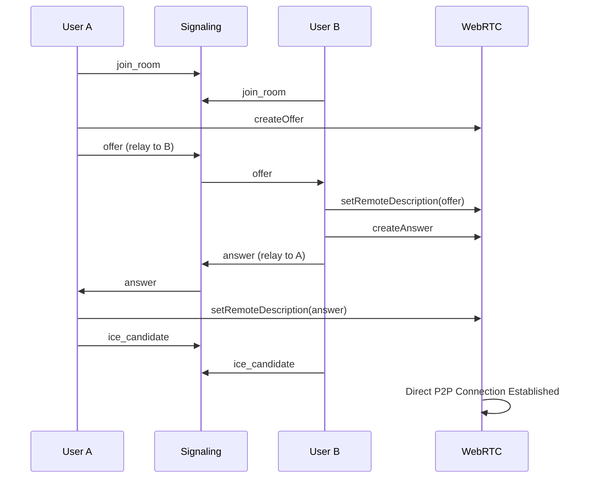

# VoiceChat 系统架构

## 概述

VoiceChat 采用前后端分离架构，后端使用 Go 语言开发，前端使用 React + TypeScript。系统支持实时语音对话、多人语音房间和 AI 语音交互。

## 系统架构图



## 核心组件

### 1. 网关层 (Gateway)

#### HTTP Server (`:8080`)
- **技术**: Gin Web 框架
- **职责**:
  - RESTful API 路由
  - 用户认证 (注册/登录/OAuth)
  - 房间管理 (创建/列表/加入/离开)
  - 健康检查

#### WebSocket Server (`:8081`)
- **职责**:
  - 实时消息通信
  - AI 语音聊天管道
  - 流式 LLM 响应
  - 并发 TTS 合成
  - 智能打断处理

#### Signaling Server (`:8082`)
- **职责**:
  - WebRTC 信令转发
  - 房间状态管理
  - 用户连接跟踪
  - 空闲房间清理

### 2. 服务层 (Services)

#### Auth Service
- JWT Token 生成和验证
- OAuth2 (GitHub/Google) 集成
- 密码注册和登录

#### Room Service
- 房间 CRUD 操作
- 成员管理
- 房间容量控制

#### User Service
- 用户信息管理
- 头像管理

#### LLM Service
- OpenRouter API 集成
- 流式文本响应
- 支持多种 LLM 模型

### 3. 语音服务层 (Voice Services)

#### Sherpa ASR (自动语音识别)
- **模型**: sherpa-onnx-streaming-paraformer-bilingual-zh-en
- **功能**: 实时语音转文字
- **输入**: 16kHz PCM 音频 (float32)
- **输出**: 识别文本

#### Kokoro TTS (语音合成)
- **模型**: kokoro-en-v0_19
- **功能**: 文字转语音
- **特性**:
  - 流式合成
  - 多语音支持
  - 可调语速

#### WebRTC VAD (语音活动检测)
- **实现**: `internal/voice/webrtc_vad.go`
- **功能**: 检测语音活动、静音和语音段
- **用途**: 语音管道优化

#### Streaming Pipeline
- **流程**: ASR -> LLM -> TTS
- **特性**:
  - 并发 LLM 和 TTS
  - 流式响应
  - 智能打断支持

### 4. 数据层 (Data)

#### PostgreSQL
- 用户数据
- 房间数据
- 关系数据

#### Redis
- 会话管理
- 缓存
- 实时状态

## 数据流

### AI 语音聊天流程



### WebRTC 通话流程



## 目录结构

```
/workspace/
├── cmd/server/              # 服务入口点
├── internal/
│   ├── gateway/
│   │   ├── http/           # HTTP API 路由和处理器
│   │   │   ├── handler/    # HTTP 请求处理器
│   │   │   ├── middleware/ # 中间件
│   │   │   └── router.go  # 路由定义
│   │   └── websocket/      # WebSocket 服务器
│   │       └── server.go  # WebSocket 处理逻辑
│   ├── voice/              # 语音服务
│   │   ├── asr.go         # ASR 客户端
│   │   ├── tts.go         # TTS 客户端
│   │   ├── vad.go         # VAD 实现
│   │   ├── webrtc_vad.go  # WebRTC VAD
│   │   ├── interfaces.go  # 语音服务接口
│   │   └── streaming_pipeline.go # 流式管道
│   ├── auth/              # 认证服务
│   ├── ai/                # LLM 服务
│   ├── signaling/         # WebRTC 信令
│   ├── user/              # 用户服务
│   ├── room/              # 房间服务
│   └── config/            # 配置管理
├── pkg/
│   ├── errors/            # 错误处理
│   ├── models/            # 数据模型
│   └── utils/             # 工具函数
├── config/
│   └── config.yaml        # 配置文件
├── frontend/              # React 前端
├── deploy/                # 部署配置
│   ├── k8s/              # Kubernetes 配置
│   └── nginx/            # Nginx 配置
├── models/               # AI 模型文件
├── docker-compose.yml    # 开发环境
└── docker-compose.prod.yml # 生产环境
```

## 配置管理

系统使用 Viper 进行配置管理，支持多种配置源：

1. `config/config.yaml` - 配置文件
2. 环境变量 - 运行时覆盖
3. 命令行标志 - 最高优先级

详细配置见 [config.yaml](../config/config.yaml)

## 安全考虑

1. **认证**: JWT Token + OAuth2
2. **输入验证**: 请求参数校验
3. **限流**: 音频负载和文本长度限制
4. **连接管理**: WebSocket 心跳和超时
5. **CORS**: 开发环境允许跨域
