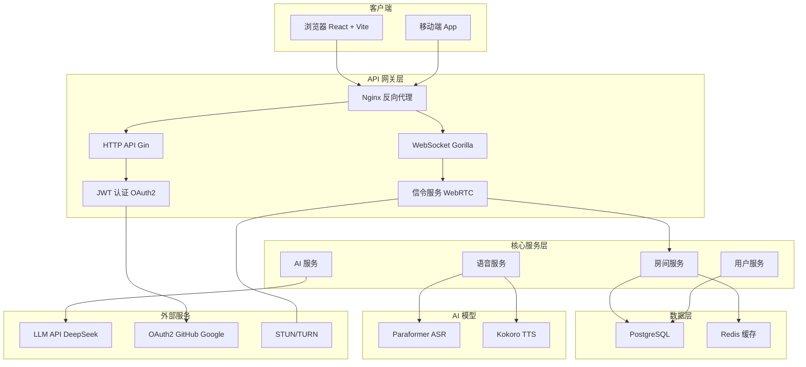
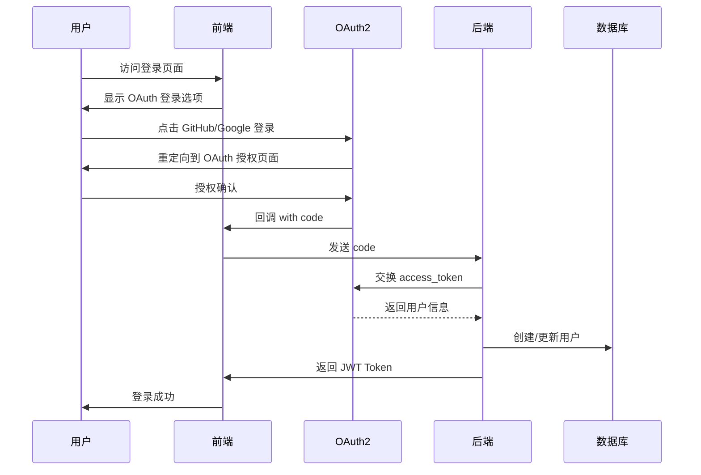
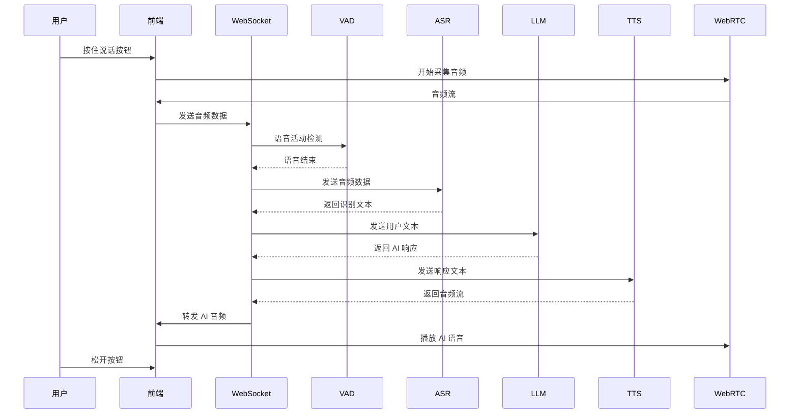
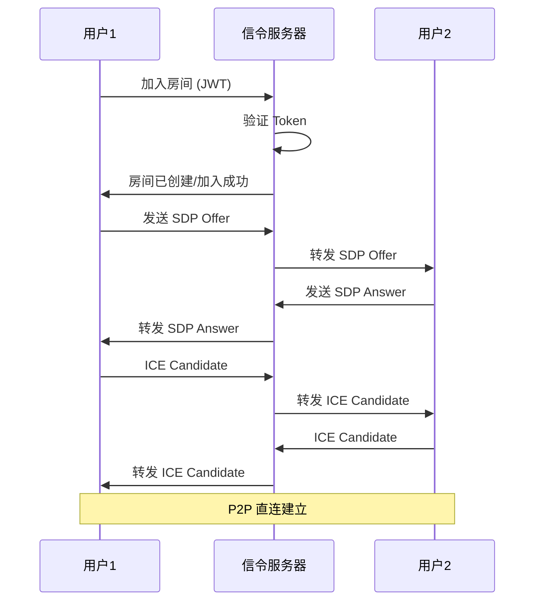

# VoiceChat

实时语音 AI 聊天系统，使用 WebSocket 进行实时通信，Sherpa-ONNX 进行语音识别（ASR）和语音合成（TTS）。

## 技术栈

- **后端**: Go + WebSocket + PostgreSQL + Redis
- **前端**: React + Vite + TypeScript + TailwindCSS
- **语音**: Sherpa-ONNX (Paraformer ASR + Kokoro TTS)
- **AI**: DeepSeek LLM API

## 项目结构

```
.
├── cmd/server/          # Go 后端服务器
├── internal/            # 内部包
│   ├── ai/             # LLM 服务
│   ├── auth/           # 认证
│   ├── config/         # 配置
│   ├── gateway/        # 网关 (HTTP, WebSocket)
│   ├── repository/     # 数据访问层
│   ├── room/           # 房间管理
│   ├── signaling/      # 信令服务
│   ├── user/           # 用户管理
│   └── voice/          # 语音服务 (ASR/TTS)
├── pkg/                # 公共包
│   ├── models/         # 数据模型
│   └── utils/          # 工具函数
├── models/             # AI 模型
│   ├── paraformer/     # ASR 模型
│   └── kokoro/         # TTS 模型
├── frontend/           # React 前端
├── deploy/            # 部署配置
└── docs/              # 文档
```

## 系统架构



### 组件说明

| 组件 | 技术 | 说明 |
|------|------|------|
| Nginx | 反向代理 | 负载均衡、SSL 终结 |
| HTTP API | Gin | RESTful API |
| WebSocket | Gorilla | 实时通信 |
| 信令服务 | WebRTC | SDP offer/answer、ICE candidate 转发 |
| ASR | Paraformer | 语音识别 |
| TTS | Kokoro | 语音合成 |
| LLM | DeepSeek | 大语言模型 |

## 核心流程

### 1. 用户认证流程



### 2. 语音聊天流程



### 3. WebRTC 信令流程



## 快速开始

### 1. 下载 AI 模型

模型文件较大（3GB），需要单独下载：

```bash
# 创建模型目录
mkdir -p models/paraformer models/kokoro

# 下载 Paraformer ASR 模型 (607MB + 218MB + 158MB + 69MB)
cd models/paraformer
wget https://github.com/snakers4/sherpa-onnx/releases/download/asr-models/sherpa-onnx-streaming-paraformer-bilingual-zh-en.tar.bz2
tar -xjf sherpa-onnx-streaming-paraformer-bilingual-zh-en.tar.bz2
mv sherpa-onnx-streaming-paraformer-bilingual-zh-en/* .
rmdir sherpa-onnx-streaming-paraformer-bilingual-zh-en

# 下载 Kokoro TTS 模型 (330MB)
cd ../kokoro
wget https://github.com/remsky/Kokoro-ONNX/releases/download/v0.19.0/kokoro-en-v0_19.tar.bz2
tar -xjf kokoro-en-v0_19.tar.bz2

# 返回项目根目录
cd ../..
```

或使用脚本自动下载：

```bash
bash deploy/install.sh
```

### 2. 启动后端

```bash
go mod download
go run cmd/server/main.go
```

### 3. 启动前端

```bash
cd frontend
npm install
npm run dev
```

### 3. 配置

环境变量或配置文件参考 `internal/config/config.go`。

## 功能

- 实时语音聊天
- AI 语音响应
- 文本聊天
- WebRTC 音视频通话
- 用户认证
- 房间管理

## 端口

- HTTP API: 8080
- WebSocket: 8081
- Signaling: 8082
- Frontend: 3000
